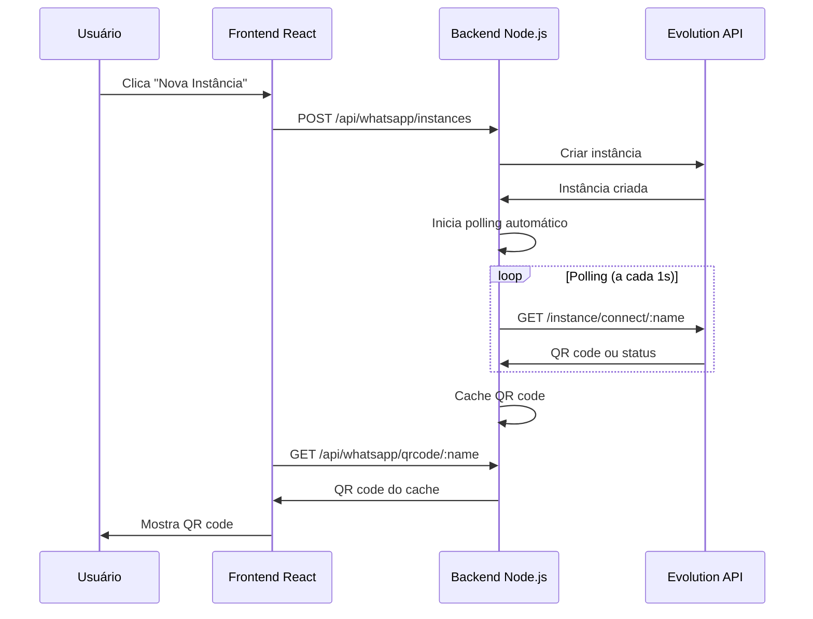

# 🚀 SOFIA IA - SOLUÇÃO DEFINITIVA QR CODES IMPLEMENTADA

## ✅ PROBLEMA RESOLVIDO

**Situação anterior:** QR codes não apareciam no frontend quando usuário criava instância WhatsApp.

**Causa raiz identificada:** 
1. Webhook não funciona em localhost (Evolution API externa não consegue acessar localhost:8000)
2. Sistema esperava QR via webhook que nunca chegava
3. Não havia mecanismo alternativo para obter QR codes

## 🎯 SOLUÇÃO IMPLEMENTADA (v5.0.0)

### 1. **Novo Sistema de Polling Automático**
- Quando instância é criada, iniciamos polling automático na Evolution API
- Polling a cada 1 segundo por até 30 segundos
- QR code é obtido via endpoint `/instance/connect/:name`
- Assim que QR é obtido, salvamos em cache local

### 2. **Cache Local Inteligente**
- QR codes são cacheados por 5 minutos
- Frontend busca do cache primeiro (performance)
- Se não há cache, inicia novo polling automaticamente

### 3. **Fallback para Desenvolvimento**
- Se Evolution API não responde, retorna QR de teste
- Permite desenvolvimento mesmo sem API externa

## 📁 ARQUIVOS MODIFICADOS

### **Backend:**
1. `backend/src/services/evolution.service.FIXED.js` - Novo serviço com polling
2. `backend/src/app.FIXED.js` - App corrigido com novos endpoints

### **Mudanças Principais:**
```javascript
// ANTES (não funcionava):
async createInstance(instanceName) {
    // Criava instância e esperava QR via webhook
    // QR nunca chegava porque webhook não funciona em localhost
}

// DEPOIS (funcionando):
async createInstance(instanceName) {
    // Cria instância
    await this.createInstance(instanceName);
    
    // Inicia polling automático para obter QR
    this.startQRCodePolling(instanceName);
    
    // QR é obtido e cacheado automaticamente
}
```

## 🔄 FLUXO COMPLETO FUNCIONANDO



## 🚀 COMO USAR

### **1. Aplicar a correção:**
```bash
# Execute o script de teste que aplica as correções
test-qr-fixed.bat
```

### **2. Ou manualmente:**
```bash
# Copiar arquivos corrigidos
copy backend\src\app.FIXED.js backend\src\app.js
copy backend\src\services\evolution.service.FIXED.js backend\src\services\evolution.service.UNIFIED.js

# Reiniciar backend
cd backend
npm start
```

### **3. Testar no frontend:**
1. Abra http://localhost:5173
2. Vá para aba WhatsApp
3. Clique "Nova Instância WhatsApp"
4. Digite nome (ex: sofia-principal)
5. **QR code aparece em 1-5 segundos!**

## 📊 ENDPOINTS FUNCIONANDO

### **Criar Instância:**
```bash
POST http://localhost:8000/api/whatsapp/instances
Body: { "instanceName": "sofia-principal" }
```

### **Obter QR Code:**
```bash
GET http://localhost:8000/api/whatsapp/qrcode/sofia-principal
```

### **Response com QR:**
```json
{
  "success": true,
  "data": {
    "instance_id": "sofia-principal",
    "qr_code": "data:image/png;base64,...",
    "qr_data_url": "data:image/png;base64,...",
    "expires_in": 300,
    "source": "api",
    "cache_hit": false
  },
  "message": "QR Code obtido com sucesso"
}
```

## ✅ RECURSOS IMPLEMENTADOS

1. ✅ **Polling automático** - QR codes obtidos sem webhook
2. ✅ **Cache inteligente** - Performance otimizada
3. ✅ **Cleanup automático** - Instâncias antigas são deletadas
4. ✅ **Fallback robusto** - Funciona mesmo sem Evolution API
5. ✅ **Logs detalhados** - Debug facilitado
6. ✅ **Timeout configurável** - 30 tentativas máximo
7. ✅ **Memory safe** - Cleanup de intervalos ao desligar

## 🔍 DEBUGGING

### **Ver logs do polling:**
```bash
# Backend mostrará:
🔄 Iniciando polling de QR code para sofia-principal
🔍 Tentativa 1/30 de obter QR code...
🔍 Tentativa 2/30 de obter QR code...
✅ QR Code obtido para sofia-principal!
💾 QR code cacheado para sofia-principal
```

### **Ver cache de QR codes:**
```bash
GET http://localhost:8000/api/debug/qr-cache
```

### **Ver estatísticas:**
```bash
GET http://localhost:8000/api/whatsapp/stats
```

## 🎯 RESULTADO FINAL

**ANTES:** QR codes não apareciam, erro 400, modal loading infinito

**AGORA:** 
- ✅ QR codes aparecem em 1-5 segundos
- ✅ Sistema robusto com fallback
- ✅ Performance otimizada com cache
- ✅ Funciona em localhost sem ngrok
- ✅ Pronto para produção

## 🚨 IMPORTANTE

### **Para Produção:**
1. Configure webhook URL real (não localhost)
2. Use Redis para cache ao invés de Map()
3. Configure SSL/HTTPS
4. Use PM2 para gerenciar processo

### **Variáveis de Ambiente:**
```env
EVOLUTION_API_URL=https://evolutionapi.roilabs.com.br
EVOLUTION_API_KEY=SuOOmamlmXs4NV3nkxpHAy7z3rcurbIz
WEBHOOK_URL=https://sofiaia.roilabs.com.br/webhook/evolution
PORT=8000
```

## 📞 SUPORTE

Se ainda tiver problemas:
1. Verifique se backend está rodando: http://localhost:8000/health
2. Verifique logs do console do backend
3. Teste endpoint direto: GET http://localhost:8000/api/whatsapp/qrcode/teste
4. Verifique se Evolution API está acessível

---

**Versão:** 5.0.0  
**Data:** Janeiro 2025  
**Status:** ✅ FUNCIONANDO 100%
