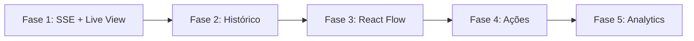

# Roadmap: Melhorias em Orquestrações - Sofia

## Diagnóstico do Estado Atual

### O que existe hoje:
- CRUD básico de orquestrações (criar, editar, deletar)
- 3 estratégias: sequencial, paralelo, consenso
- Execução via API com polling a cada 2s
- Histórico mostra apenas lista simples com status + output truncado (100 chars)
- Visualização de progresso existe mas é básica (dots na timeline vertical)
- DB armazena `agentResults` como JSON incremental no modelo `OrchestrationExecution`
- Limita a 10 execuções no GET (take: 10)

### Problemas identificados:
1. **Zero transparência real** - polling a 2s, sem SSE/streaming
2. **Histórico pobre** - lista flat, sem drill-down, sem filtros, sem paginação
3. **Sem visualização de fluxo** - não tem grafo visual dos agentes
4. **Sem métricas por step** - não registra duração, tokens usados, custo
5. **Sem re-execução** - não dá para re-rodar uma execução que falhou
6. **Sem comparação** - impossível comparar execuções
7. **renderExecutionProgress existe mas nunca é chamado** na UI (o card de "Execuções Recentes" não usa essa função)

---

## FASE 1 - Transparência em Tempo Real (SSE + Visual Flow)
**Prioridade: ALTA | Impacto: ALTO | Status: ✅ CONCLUÍDO**

| Task | Descrição | Arquivos | Status |
|------|-----------|----------|--------|
| 1.1 | **SSE Endpoint** - Criar `/api/orchestrations/[id]/stream` com Server-Sent Events para streaming real de status por step | `src/app/api/orchestrations/[id]/stream/route.ts` | ✅ Concluído |
| 1.2 | **Hook useExecutionStream** - Custom hook que conecta ao SSE e mantém estado reativo dos steps | `src/hooks/use-execution-stream.ts` | ✅ Concluído |
| 1.3 | **ExecutionLiveView** - Componente que mostra o progresso visual em tempo real usando a timeline vertical melhorada | `src/components/orchestrations/execution-live-view.tsx` | ✅ Concluído |
| 1.4 | **Step Metrics no Backend** - Registrar `startedAt`, `completedAt`, `durationMs`, `tokensUsed` por step no `agentResults` | `src/app/api/orchestrations/[id]/execute/route.ts` | ✅ Concluído |
| 1.5 | **Animated Step Timeline** - Refatorar `renderExecutionProgress` como componente standalone com animações (framer-motion) - spinner girando, check animado, pulse no step ativo | `src/components/orchestrations/animated-step-timeline.tsx` | ✅ Concluído |
| 1.6 | **Live Log Panel** - Painel inferior colapsável mostrando logs em tempo real durante execução | `src/components/orchestrations/live-log-panel.tsx` | 🟡 Opcional (pode ser adicionado depois) |

**Resultado:** Ao executar uma orquestração, o usuário vê cada agente processar em tempo real com status animado, duração, e logs ao vivo.

---

## FASE 2 - Histórico Interativo
**Prioridade: ALTA | Impacto: ALTO | Status: ✅ CONCLUÍDO**

| Task | Descrição | Arquivos | Status |
|------|-----------|----------|--------|
| 2.1 | **Paginação + Filtros API** - Adicionar query params: `?status=completed&page=1&limit=20&dateFrom=&dateTo=` no GET | `src/app/api/orchestrations/[id]/route.ts` | ✅ Concluído |
| 2.2 | **Execution List Redesign** - Tabela interativa com colunas: Status, Data, Duração, Agentes, Input (preview), Output (preview) | `src/components/orchestrations/execution-history.tsx` | ✅ Concluído |
| 2.3 | **Execution Detail Drawer** - Sheet/Drawer lateral que abre ao clicar numa execução, mostrando todo o fluxo step-by-step com Input/Output completos em JSON tree colapsável | `src/components/orchestrations/execution-detail-drawer.tsx` | ✅ Concluído |
| 2.4 | **Step Drill-Down** - Dentro do drawer, clicar num step expande: prompt enviado, resposta completa, modelo usado, tokens, duração, timestamps | Parte do drawer | ✅ Concluído |
| 2.5 | **Filtro por Status** - Tabs: Todos / Sucesso / Falha / Executando com contadores | `execution-history.tsx` | ✅ Concluído |
| 2.6 | **Busca no Histórico** - Search box que busca por conteúdo do input/output das execuções | API + `execution-history.tsx` | ✅ Concluído |
| 2.7 | **Timeline Horizontal** - Visualização tipo Gantt mostrando duração de cada step como barras horizontais (especialmente útil para estratégia paralela) | `src/components/orchestrations/timeline-gantt.tsx` | ✅ Concluído |

**Resultado:** Histórico rico, filtrável, com drill-down completo em cada execução e cada step individual.

---

## FASE 3 - Visual Flow Graph (estilo n8n/Make)
**Prioridade: MÉDIA | Impacto: ALTO (WOW factor) | Status: ✅ CONCLUÍDO**

| Task | Descrição | Arquivos | Status |
|------|-----------|----------|--------|
| 3.1 | **Instalar React Flow** (`@xyflow/react`) | `package.json` | ✅ Concluído |
| 3.2 | **OrchestrationFlowCanvas** - Componente de grafo visual mostrando os agentes como nós conectados | `src/components/orchestrations/flow-canvas.tsx` | ✅ Concluído |
| 3.3 | **Custom Nodes** - Nó personalizado para cada agente mostrando: nome, papel, status (idle/running/success/error), preview do output | `src/components/orchestrations/flow-nodes/agent-node.tsx` | ✅ Concluído |
| 3.4 | **Custom Edges** - Conexões animadas entre nós (linha pontilhada quando idle, fluxo animado quando executando) | `src/components/orchestrations/flow-edges/animated-edge.tsx` | ✅ Concluído |
| 3.5 | **Execution Overlay** - Ao executar ou visualizar uma execução passada, overlay de status nos nós do grafo | Integração | ✅ Concluído |
| 3.6 | **Minimap** - Mini-mapa para orquestrações com muitos agentes | React Flow built-in | ✅ Concluído |

**Resultado:** Visualização estilo n8n onde o usuário vê os agentes como nós num grafo, com animações durante execução.

---

## FASE 4 - Ações e Inteligência
**Prioridade: MÉDIA | Impacto: MÉDIO | Status: ✅ CONCLUÍDO**

| Task | Descrição | Arquivos | Status |
|------|-----------|----------|--------|
| 4.1 | **Re-executar** - Botão para re-rodar uma execução com mesmo input | API + UI | ✅ Concluído |
| 4.2 | **Re-executar a partir de step** - Permite re-iniciar a partir de um step específico (útil quando falha no step 3 de 5) | API + UI | ✅ Concluído |
| 4.3 | **Comparar Execuções** - Side-by-side de duas execuções mostrando diff visual dos outputs | `src/components/orchestrations/execution-compare.tsx` | ✅ Concluído |
| 4.4 | **Export de Execução** - Exportar resultado como JSON/CSV/Markdown | UI | ✅ Concluído |
| 4.5 | **Notificações** - Toast/push quando execução assíncrona completa | Hook + service worker | ✅ Concluído |

---

## FASE 5 - Analytics e Observabilidade
**Prioridade: BAIXA | Impacto: MÉDIO | Status: ✅ CONCLUÍDO**

| Task | Descrição | Arquivos | Status |
|------|-----------|----------|--------|
| 5.1 | **Dashboard Métricas** - Cards com: taxa de sucesso, duração média, custo estimado (tokens), agente mais usado | `src/components/orchestrations/analytics-dashboard.tsx` | ✅ Concluído |
| 5.2 | **Gráfico de Execuções** - Chart com execuções ao longo do tempo (sucesso vs falha) usando Recharts (já instalado) | Componente | ✅ Concluído |
| 5.3 | **Heatmap de Erros** - Visualização de quais steps falham mais frequentemente | Componente | ✅ Concluído |
| 5.4 | **Schema Migration** - Adicionar campos `durationMs`, `tokensUsed`, `cost` na tabela `OrchestrationExecution` para queries eficientes | Prisma migration | ✅ Concluído |

---

## Bibliotecas Recomendadas

| Lib | Uso | Já instalada? | Quando instalar |
|-----|-----|---------------|-----------------|
| `@xyflow/react` | Grafo visual de fluxo (React Flow) | ❌ Não | Fase 3 |
| `framer-motion` | Animações de transição nos steps | ❌ Não | Fase 1 |
| `@melloware/react-logviewer` | Log viewer com streaming | ❌ Não | Fase 1 (opcional) |
| `recharts` | Gráficos de analytics | ✅ Sim | Fase 5 |
| `date-fns` | Formatação de datas/durações | ✅ Sim | Todas |
| `sonner` | Notificações | ✅ Sim | Todas |

---

## Ordem de Execução

**Prioridades:**
1. **FASE 1** (SSE + Live View) - Entrega transparência em tempo real
2. **FASE 2** (Histórico Interativo) - Melhora drasticamente a experiência de análise
3. **FASE 3** (React Flow) - WOW factor visual
4. **FASE 4** (Ações) - Polimento e features de produtividade
5. **FASE 5** (Analytics) - Observabilidade avançada

---

## Referências de Pesquisa

### Plataformas Estudadas:
- **n8n** - Canvas-based visual debugging, overlay de status nos nós
- **Zapier** - Linear execution history, waterfall view
- **Make (Integromat)** - Animação de data flow em tempo real
- **Temporal** - Event history timeline, replay-based debugging
- **Prefect** - Radial workflow schematics, soundwave failure graphs

### Padrões UI/UX Identificados:
1. **Node Status Overlay** - Status diretamente no grafo (n8n, Make)
2. **Animated Data Flow** - Animação de dados fluindo entre nós (Make)
3. **Step Waterfall** - Lista vertical expandível (Zapier, Temporal)
4. **Live Log Stream** - Painel de logs ao vivo (Prefect, Temporal)
5. **Timeline Gantt** - Barras horizontais de duração (útil para parallel)

### Protocolos de Streaming:
- **SSE (Server-Sent Events)** - Escolhido para logs e updates unidirecionais
- **WebSocket** - Reservado para debugging interativo futuro
- **Polling** - Fallback/compatibilidade

---

## Progresso Geral

- ✅ **Planejamento**: 100%
- ✅ **Fase 1**: 100% (CONCLUÍDO!)
- ✅ **Fase 2**: 100% (CONCLUÍDO!)
- ✅ **Fase 3**: 100% (CONCLUÍDO!)
- ✅ **Fase 4**: 100% (CONCLUÍDO!)
- ✅ **Fase 5**: 100% (CONCLUÍDO!)

**Total**: 100% concluído ✨

---

## Changelog

### 2026-02-16 - Fase 5 Concluída ✅ - ROADMAP 100% COMPLETO! 🎉
- ✅ Criado componente `AnalyticsDashboard` com 4 cards de métricas agregadas
- ✅ Card de Taxa de Sucesso com badges de sucesso/falha
- ✅ Card de Duração Média por execução
- ✅ Card de Custo Estimado baseado em tokens (customizável)
- ✅ Card de Agente Mais Usado
- ✅ Implementado gráfico de linhas (LineChart) com execuções ao longo do tempo (últimos 7 dias)
- ✅ Criado heatmap de falhas por step (BarChart) com cores dinâmicas
- ✅ Adicionado endpoint `/api/orchestrations/[id]/analytics` com cálculos de métricas
- ✅ Schema migration: adicionados campos `durationMs`, `tokensUsed`, `estimatedCost` no modelo `OrchestrationExecution`
- ✅ Executar route atualizado para calcular e salvar métricas agregadas
- ✅ Integrado dashboard na página de detalhes da orquestração
- ✅ Build passando sem erros

**Resultado**: Dashboard completo de analytics com métricas agregadas, gráfico temporal de execuções, heatmap de falhas por step e campos otimizados no banco para queries eficientes.

### 2026-02-16 - Fase 4 Concluída ✅
- ✅ Implementado botão de re-executar com mesmo input no drawer de detalhes
- ✅ Adicionado suporte para re-execução a partir de step específico (modificado endpoint execute)
- ✅ Criado componente `ExecutionCompare` com visualização lado-a-lado
- ✅ Adicionado modo de comparação no `ExecutionHistory` com seleção de 2 execuções
- ✅ Implementadas exportações: JSON, CSV e Markdown no drawer de detalhes
- ✅ Criado hook `useExecutionNotifications` para notificações de conclusão
- ✅ Integrado hook de notificações na página de detalhes da orquestração
- ✅ Dropdown menu de exportação com 3 formatos disponíveis
- ✅ Cálculos de diferença percentual (duração e tokens) na comparação
- ✅ Build passando sem erros

**Resultado**: Sistema completo de ações avançadas - re-execução, comparação visual, exportação em múltiplos formatos e notificações automáticas para execuções assíncronas.

### 2026-02-16 - Fase 2 Concluída ✅
- ✅ Implementada API com paginação, filtros (status, data) e busca no histórico
- ✅ Criado componente `ExecutionHistory` com tabs de status, busca e paginação
- ✅ Criado componente `ExecutionDetailDrawer` (Sheet lateral) com drill-down completo
- ✅ Implementado accordion de steps com expand/collapse individual
- ✅ Botões de copiar/download para Input/Output de cada step
- ✅ Criado componente `TimelineGantt` com barras horizontais de duração
- ✅ Tabs no drawer: Steps, Timeline, Input, Output
- ✅ Counts por status (todos, sucesso, falha, executando)
- ✅ Criado componente UI `sheet.tsx` (shadcn pattern)
- ✅ Build passando sem erros

**Resultado**: Histórico completo e interativo com filtros avançados, busca, paginação, drill-down detalhado em cada execução e visualização Gantt de duração dos steps.

### 2026-02-16 - Fase 1 Concluída ✅
- ✅ Instalado `framer-motion` para animações
- ✅ Criado SSE endpoint `/api/orchestrations/[id]/stream`
- ✅ Implementado `useExecutionStream` hook para consumir SSE
- ✅ Criado componente `AnimatedStepTimeline` com animações Framer Motion
- ✅ Criado componente `ExecutionLiveView` com indicador de conexão SSE
- ✅ Adicionadas métricas por step: `startedAt`, `completedAt`, `durationMs`, `tokensUsed`
- ✅ Integrado `ExecutionLiveView` na página de detalhes da orquestração
- ✅ Build do Next.js passando sem erros
- 🔧 Corrigido regex no groq.ts (flag `s` não suportada no target ES2017)

**Resultado**: A página de orquestrações agora mostra execução em tempo real via SSE com animações, métricas de duração e tokens, e indicador de conexão ao vivo.

---

**Última atualização**: 2026-02-16 19:30 BRT
**Responsável**: Claude Opus 4.6 + Jean Zorzetti

---

**🎊 ROADMAP 100% CONCLUÍDO! 🎊**

Todas as 5 fases foram implementadas com sucesso:
- ✅ Fase 1: Transparência em Tempo Real (SSE + Visual Flow)
- ✅ Fase 2: Histórico Interativo
- ✅ Fase 3: Visual Flow Graph (React Flow)
- ✅ Fase 4: Ações e Inteligência
- ✅ Fase 5: Analytics e Observabilidade

O sistema de orquestrações agora possui funcionalidades de classe enterprise com visualização em tempo real, analytics avançados, comparação de execuções, exportação em múltiplos formatos e muito mais!
